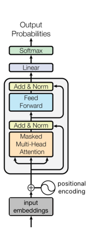

# 🧠 Simple Decoder-Only Transformer in MLX

This notebook demonstrates a minimal decoder-only Transformer model using Apple's `mlx` library. It's inspired by GPT-like architecture and trained on raw character data.

---

## 🧾 Data Preparation

```python
with open("input.txt", "r", encoding='utf-8') as f:
    text = f.read()

vocab = sorted(list(set(text)))
#character level encoding
stoi = {c: i for i, c in enumerate(vocab)}
#chacter level decoding
iots = {i: c for i, c in enumerate(vocab)}
```

### 🔹 Explanation:

- The dataset is a plain text file.
- We create a character-level vocabulary and mapping functions:
  - `encode("hi") → [7, 10]`
  - `decode([7, 10]) → "hi"`

---

## 📦 Batching and Input Formatting

```python
ctx_len = 128
#training data
X_train = mx.array([train_data[i: i+ctx_len]
                   for i in range(0, len(train_data) - ctx_len, ctx_len)])
y_train = mx.array([train_data[i+1: i+ctx_len+1]
                   for i in range(0, len(train_data) - ctx_len, ctx_len)])

#validation data
X_val = mx.array([train_data[i: i+ctx_len]
                 for i in range(0, len(val_data) - ctx_len, ctx_len)])
y_val = mx.array([train_data[i+1: i + ctx_len+1]
                 for i in range(0, len(val_data) - ctx_len, ctx_len)])
```

### 🔹 Explanation:

- `ctx_len` is context length: how many tokens the model looks at.
- The model is trained to predict the next character in a sequence.
- Input: "The cat sa"
- Label: "he cat sat"

---

## 🧮 Model Components

### 🔹 Self-Attention Layer

<p align="center">
  
</p>

```python
class Attention(nn.Module):
    def __init__(self, head_size):
        ...
        self.k_proj = nn.Linear(n_emb, head_size)
        self.q_proj = nn.Linear(n_emb, head_size)
        self.v_proj = nn.Linear(n_emb, head_size)

    def __call__(self, x):
        ...
        scores = q @ k.transpose(...) / sqrt(head_size)
        weights = masked_softmax(scores)
        out = weights @ v
        return out
```

**Key idea**: Let each token "look" at others to decide which are important.

Example:

> Token "cat" may attend more to "sat" than "the".

---

### 🔹 Multi-Head Attention

<p align="center">
  
</p>

```python
class MultiHeadAttention(nn.Module):
    def __init__(self, n_heads, head_size):
        self.heads = [Attention(head_size) for _ in range(n_heads)]
```

**Why?** Multiple attention heads let the model learn different patterns (e.g., syntax vs. semantics).

---

### 🔹 Transformer Block

```python
class Block(nn.Module):
    def __init__(self, ...):
        ...

    def __call__(self, x):
      x = x + self.mha(self.ln_1(x))
      x = x + self.mlp(self.ln_2(x))
```

Each block = self-attention + feed-forward + residual connections.

---

## 🧠 Full Transformer Model (Decoder-only)

- This is an edited version of original transformer presented in the **_Attention Is All You Need_** paper.

<p align="center">
  
</p>

```python
class Transformer(nn.Module):
    def __init__(self):
        self.token_embedding = nn.Embedding(vocab_size, n_emb)
        self.pos_embedding = nn.Embedding(ctx_len, n_emb)
        self.blocks = [Block(...) for _ in range(n_layers)]
        self.ln = nn.LayerNorm(n_emb)
        self.output = nn.Linear(n_emb, vocab_size)
```

### 🔹 Explanation:

- `token_embedding` turns characters into vectors.
- `pos_embedding` adds position info (i.e., token order).
- Stack of blocks enables deep learning.
- Final `Linear` layer maps back to character probabilities.

---

## ⚙️ Training Loop

```python
for epoch in range(num_epochs):
    for xb, yb in get_batches(...):
        logits = model(xb)
        loss = loss_fn(logits, yb)
        loss.backward()
        optimizer.step()
```

Model learns by comparing predictions (`logits`) to real next tokens (`yb`) using cross-entropy loss.

---

## 📝 Example Output

After training on some text:

Input: `"the cat s"`  
Output: `"he cat sa"` → `"he cat sat"`

---

## ✅ Summary

| Component           | Purpose                        |
| ------------------- | ------------------------------ |
| Embedding           | Convert characters to vectors  |
| Self-Attention      | Learn which tokens to focus on |
| Positional Encoding | Preserve sequence order        |
| Transformer Block   | Stack of attention + FF layers |
| Linear + Softmax    | Predict next character         |
